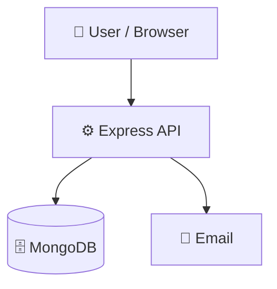

# Alumni-collage

> Full-stack alumni network platform for college communities, events, and job postings.

      

## 📑 Table of Contents

- [Description](#description)
- [Key Features](#key-features)
- [Use Cases](#use-cases)
- [Tech Stack](#tech-stack)
- [Architecture](#architecture)
- [Quick Start](#quick-start)
- [Key Dependencies](#key-dependencies)
- [Available Scripts](#available-scripts)
- [API Endpoints](#api-endpoints)
- [Project Structure](#project-structure)
- [Development Setup](#development-setup)
- [Contributors](#contributors)
- [Contributing](#contributing)
- [License](#license)

## 📝 Description

Alumni-collage is a full-stack web application designed to connect college graduates, students, and academic institutions. The platform centralizes alumni directory management, networking opportunities, career boards, and institutional event tracking into a single unified system.

## ✨ Key Features

- **👥 Alumni Directory and Profiles** — Dedicated routes manage alumni data and user profiles to facilitate discovery across graduation cohorts.
- **💼 Job and Career Postings** — Backend job routes provide structured endpoints to publish and explore career opportunities.
- **📅 Campus and Alumni Events** — Event management endpoints support organizing, listing, and tracking college and alumni gatherings.
- **🤝 Peer Connection Networking** — Connection routing allows users to build professional relationships and interact within the platform.
- **🔒 Authentication and User Management** — Express-based authentication and user routes secure endpoints and manage access permissions.
- **✉️ Email Notifications with Nodemailer** — Integrated Nodemailer support enables automated transactional emails and communication.

## 🎯 Use Cases

- Deploying an institutional alumni portal to track graduate career progression and facilitate mentorship.
- Hosting a private job and internship board exclusively for university students and alumni.
- Coordinating college reunions, networking webinars, and campus events through a centralized API.

## 🛠️ Tech Stack

    

**Notable libraries:** Mongoose, Nodemailer

## 🏗️ Architecture

A high-level view of how the main pieces fit together:



## ⚡ Quick Start

```bash

# 1. Clone the repository
git clone https://github.com/shivek-yadav/Alumni-collage.git

# 2. Install dependencies
npm install

# 3. Start the dev server
npm run start
```

## 📦 Key Dependencies

```
bcryptjs: ^3.0.2
cookie-parser: ^1.4.7
cors: ^2.8.5
dotenv: ^17.2.3
express: ^5.1.0
express-validator: ^7.3.0
jsonwebtoken: ^9.0.2
mongoose: ^8.19.2
nodemailer: ^7.0.10
nodemon: ^3.1.10
```

## 🚀 Available Scripts

- **start** — `npm run start`
- **dev** — `npm run dev`
- **test** — `npm run test`

## 🌐 API Endpoints

Detected endpoints (best-effort scan):

```
GET /
```

## 📁 Project Structure

```
.
├── backend
│   ├── config
│   │   └── db.js
│   ├── controllers
│   │   ├── alumniController.js
│   │   ├── authController.js
│   │   ├── connectionController.js
│   │   ├── eventController.js
│   │   ├── jobController.js
│   │   └── userController.js
│   ├── middleware
│   │   ├── async.js
│   │   └── auth.js
│   ├── models
│   │   ├── connection.js
│   │   ├── event.js
│   │   ├── job.js
│   │   └── user.js
│   ├── package.json
│   ├── routes
│   │   ├── alumni.js
│   │   ├── auth.js
│   │   ├── connections.js
│   │   ├── events.js
│   │   ├── jobs.js
│   │   └── users.js
│   ├── server.js
│   ├── services
│   │   └── alumniConnectionService.js
│   ├── utils
│   │   ├── errorResponse.js
│   │   └── sendEmail.js
│   └── versal.json
└── frontend
    ├── eslint.config.js
    ├── index.html
    ├── package.json
    ├── public
    │   └── vite.svg
    ├── src
    │   ├── App.css
    │   ├── App.jsx
    │   ├── Component
    │   │   ├── EditProfile.jsx
    │   │   ├── Event
    │   │   │   └── Event.jsx
    │   │   ├── Footer.jsx
    │   │   ├── Home.jsx
    │   │   ├── ImageSlider.js
    │   │   ├── Job.jsx
    │   │   ├── Login.jsx
    │   │   ├── Navbar.jsx
    │   │   ├── Profile.jsx
    │   │   ├── ProtectedRoute.jsx
    │   │   └── Register.jsx
    │   ├── Screen
    │   │   ├── Alumni.jsx
    │   │   └── Dashboard
    │   │       ├── AdminDashboard.jsx
    │   │       ├── AlumniDashboard.jsx
    │   │       └── StudentDashboard.jsx
    │   ├── index.css
    │   └── main.jsx
    ├── tailwind.config.js
    └── vite.config.js
```

## 🛠️ Development Setup

### Node.js / JavaScript
1. Install Node.js (v18+ recommended)
2. Install dependencies: `npm install` (or `yarn` / `pnpm install` / `bun install`)
3. Start the dev server: see the **Quick Start** above

## 👥 Contributors

Thanks to everyone who has contributed to this project:

<p align="left">
<a href="https://github.com/shivek-yadav" title="shivek-yadav"></a>
<a href="https://github.com/Gyanusah" title="Gyanusah"></a>
</p>

[See the full list of contributors →](https://github.com/shivek-yadav/Alumni-collage/graphs/contributors)

## 👥 Contributing

Contributions are welcome! Here's the standard flow:

1. **Fork** the repository
2. **Clone** your fork: `git clone https://github.com/shivek-yadav/Alumni-collage.git`
3. **Branch**: `git checkout -b feature/your-feature`
4. **Commit**: `git commit -m 'feat: add some feature'`
5. **Push**: `git push origin feature/your-feature`
6. **Open** a pull request

Please follow the existing code style and include tests for new behavior where applicable.

## 📜 License

This project is licensed under the **ISC** License.

---


